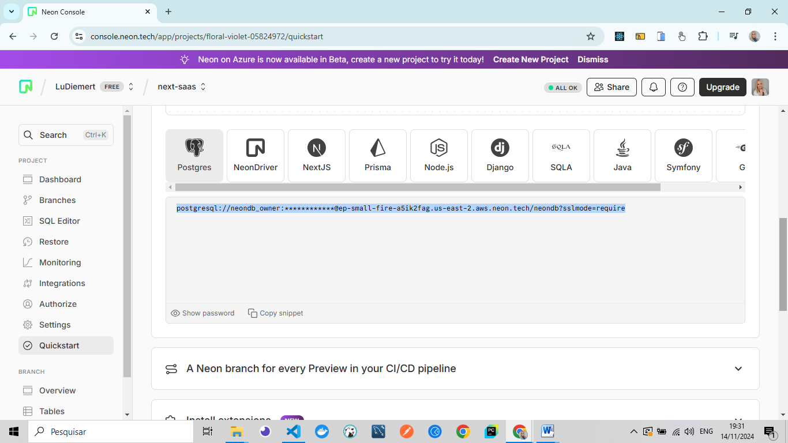
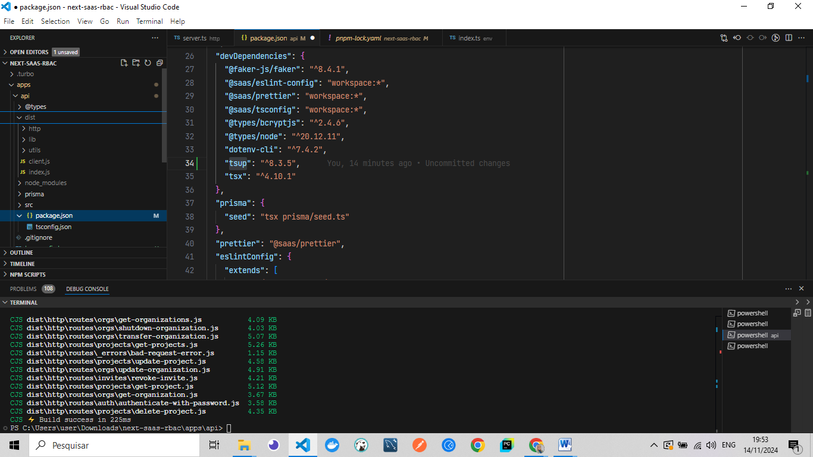
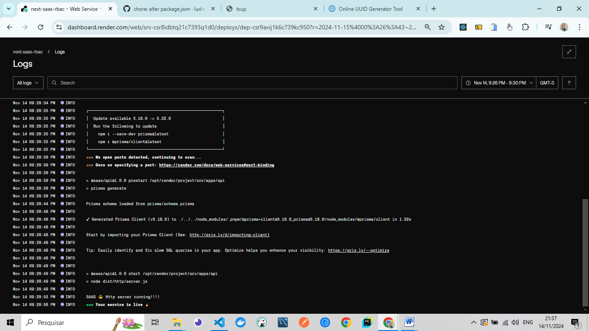
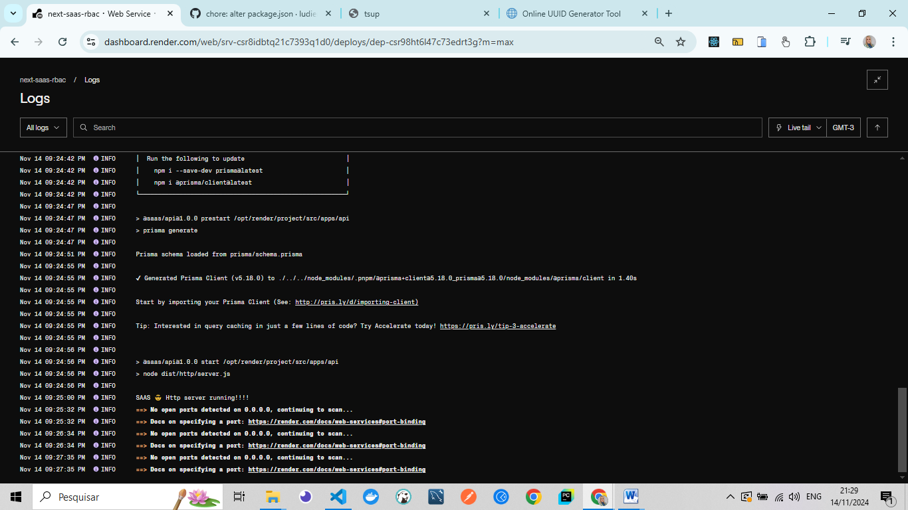

# 🚀 Fullstack Project - Software as a Service (SaaS)

I’m developing a complete SaaS application using the latest technologies from the JavaScript ecosystem. From concept to implementation, this multi-tenant software allows multiple companies to use the same application securely and efficiently.

🌟 This project was built during the **Rocketseat** course 🚀, focusing on organization and project management. By combining **Next.js**, **Fastify**, **PostgreSQL**, **Prisma**, and **TypeScript**, I created a robust and modern solution that revolutionizes how teams collaborate. A key differentiator is the implementation of **Role-Based Access Control (RBAC)**, ensuring that every user has the appropriate permissions for their activities.

---

### Img - Back_end

<div align="center">
    <table>
        <tr>
            <td style="width: 50%; text-align: center;">
                
                <p style="margin-top: 5px;">Schema.prisma - and-conection_Progress</p>
            </td>
            <td style="width: 50%; text-align: center;">
                
                <p style="margin-top: 5px;"> Prisma Studio create users</p>
            </td>
        </tr>
    </table>
</div>

  <br/>
  <br/>

  <div align="center">
    <table>
        <tr>
            <td style="width: 50%; text-align: center;">
                
                <p style="margin-top: 5px;">Prisma Studio - tables BD</p>
            </td>
            <td style="width: 50%; text-align: center;">
                
                <p style="margin-top: 5px;">Table_Fake</p>
            </td>
        </tr>
    </table>
</div>

  <br/>
  <br/>

  ---

### Img - Front_end

<div align="center">
    <table>
        <tr>
            <td style="width: 50%; text-align: center;">
                
                <p style="margin-top: 5px;">Conexao front com back teste - resp back end</p>
            </td>
            <td style="width: 50%; text-align: center;">
                
                <p style="margin-top: 5px;"> Criate_web_organization_user</p>
            </td>
        </tr>
    </table>
</div>

  <br/>
  <br/>

  <div align="center">
    <table>
        <tr>
            <td style="width: 50%; text-align: center;">
                
                <p style="margin-top: 5px;">Page_organizations_shutdown</p>
            </td>
            <td style="width: 50%; text-align: center;">
                
                <p style="margin-top: 5px;">Conexao front com back teste - resp front</p>
            </td>
        </tr>
    </table>
</div>

  <br/>
  <br/>

  ---

### Img - Deploy

<div align="center">
    <table>
        <tr>
            <td style="width: 50%; text-align: center;">
                
                <p style="margin-top: 5px;">Neon_deploy_BD.png</p>
            </td>
            <td style="width: 50%; text-align: center;">
                
                <p style="margin-top: 5px;"> Build_proj_back_end</p>
            </td>
        </tr>
    </table>
</div>

  <br/>
  <br/>

  <div align="center">
    <table>
        <tr>
            <td style="width: 50%; text-align: center;">
                
                <p style="margin-top: 5px;">Deploy_render_func_back_end</p>
            </td>
            <td style="width: 50%; text-align: center;">
                
                <p style="margin-top: 5px;">Deploy_render_func_back_end</p>
            </td>
        </tr>
    </table>
</div>

  <br/>
  <br/>
  
 
---

## 🛠️ Key Features

- Efficient organization of projects for clear and effective management.
- Full control over team members and their specific roles.
- Enhanced user experience for seamless and agile operations.
- Robust implementation of **RBAC**, improving access control security.

---

## 🧐 What is SaaS?

**Software as a Service (SaaS)** is a software distribution model where applications are hosted in the cloud and accessed via the internet. Users don’t need to install or maintain the software on their devices, as everything is managed by the provider.

---

## 🏢 Multi-Tenant Architecture

The **multi-tenant** architecture allows multiple clients to share the same software instance while keeping data and configurations isolated. This ensures:

- **Efficiency** in resource usage.
- **Security** between client data.

---

## 🚨 Permission Strategies

I adopted **Role-Based Access Control (RBAC)** strategies, enabling:

- Definition of specific permissions for each role.
- Efficient management of access within the application.
- Strengthened security with granular control over activities.

---

## 💻 Technologies Used

### Backend

- **Node.js** with **Fastify**: Fast and efficient API.
- **Prisma**: ORM for database modeling and manipulation.
- **PostgreSQL**: Robust relational database.

### Frontend

- **Next.js**: React framework for SSR (Server-Side Rendering) and SSG (Static Site Generation).
- **TypeScript**: Static typing for enhanced reliability and scalability.

### Monorepo

- **Turbo Repo**: Tool for managing monorepos and optimizing multi-package projects.

---

## 🔥 Learnings

By developing this project, you’ll gain insights into:

- SaaS fundamentals and multi-tenant architecture.
- Permission strategies using RBAC.
- Fullstack development with Node.js and Next.js.
- Project organization with Turbo Repo.

---

## 🚀 How to Run the Project

1. **Clone the repository**:
   ```bash
   git clone https:/github.com/ludiemert/next-saas-rbac.git
    ```

2.	Install dependencies:
-	In the backend directory:
   ```bash
   cd api
   ```

   ```bash
   npm install
   ```

-	In the frontend directory:
   ```bash
   cd web
   ```
   ```bash
   npm install
   ```

3.	Set up environment variables:
- Create a .env file in both the backend and frontend directories with the required variables (refer to .env.example).

4.	Run the backend server:
   ```bash
   npm run dev
   ```

5.	Start the frontend application:
   ```bash
   npm run dev
   ```
________________________________________
🤝 Contribution
Contributions are welcome! 💡
- Open issues to report bugs or suggest improvements.
- Submit pull requests with new features or fixes. <br />
📩 I’m always open to feedback and collaboration! Let’s build something amazing together.

________________________

#### Portugues🥰
# 🚀 Projeto Fullstack - Software como Serviço (SaaS)

Estou desenvolvendo uma aplicação SaaS completa usando as tecnologias mais recentes do ecossistema JavaScript. Do conceito à implementação, este software multi-tenant permite que várias empresas usem a mesma aplicação de forma segura e eficiente.

🌟 Este projeto foi desenvolvido durante o curso da **Rocketseat** 🚀, com foco em organização e gerenciamento de projetos. Ao combinar **Next.js**, **Fastify**, **PostgreSQL**, **Prisma** e **TypeScript**, criei uma solução robusta e moderna que revoluciona a forma como as equipes colaboram. Um diferencial importante é a implementação de **Controle de Acesso Baseado em Função (RBAC)**, garantindo que cada usuário tenha as permissões apropriadas para suas atividades.

---

### Img - Back_end

<div align="center">
    <table>
        <tr>
            <td style="width: 50%; text-align: center;">
                
                <p style="margin-top: 5px;">Schema.prisma - and-conection_Progress</p>
            </td>
            <td style="width: 50%; text-align: center;">
                
                <p style="margin-top: 5px;"> Prisma Studio create users</p>
            </td>
        </tr>
    </table>
</div>

  <br/>
  <br/>

  <div align="center">
    <table>
        <tr>
            <td style="width: 50%; text-align: center;">
                
                <p style="margin-top: 5px;">Prisma Studio - tables BD</p>
            </td>
            <td style="width: 50%; text-align: center;">
                
                <p style="margin-top: 5px;">Table_Fake</p>
            </td>
        </tr>
    </table>
</div>

  <br/>
  <br/>

  ---

### Img - Front_end

<div align="center">
    <table>
        <tr>
            <td style="width: 50%; text-align: center;">
                
                <p style="margin-top: 5px;">Conexao front com back teste - resp back end</p>
            </td>
            <td style="width: 50%; text-align: center;">
                
                <p style="margin-top: 5px;"> Criate_web_organization_user</p>
            </td>
        </tr>
    </table>
</div>

  <br/>
  <br/>

  <div align="center">
    <table>
        <tr>
            <td style="width: 50%; text-align: center;">
                
                <p style="margin-top: 5px;">Page_organizations_shutdown</p>
            </td>
            <td style="width: 50%; text-align: center;">
                
                <p style="margin-top: 5px;">Conexao front com back teste - resp front</p>
            </td>
        </tr>
    </table>
</div>

  <br/>
  <br/>

  ---

### Img - Deploy

<div align="center">
    <table>
        <tr>
            <td style="width: 50%; text-align: center;">
                
                <p style="margin-top: 5px;">Neon_deploy_BD.png</p>
            </td>
            <td style="width: 50%; text-align: center;">
                
                <p style="margin-top: 5px;"> Build_proj_back_end</p>
            </td>
        </tr>
    </table>
</div>

  <br/>
  <br/>

  <div align="center">
    <table>
        <tr>
            <td style="width: 50%; text-align: center;">
                
                <p style="margin-top: 5px;">Deploy_render_func_back_end</p>
            </td>
            <td style="width: 50%; text-align: center;">
                
                <p style="margin-top: 5px;">Deploy_render_func_back_end</p>
            </td>
        </tr>
    </table>
</div>

  <br/>
  <br/>
  
 
---

## 🛠️ Funcionalidades Principais

- Organização eficiente de projetos para gerenciamento claro e eficaz.
- Controle total sobre os membros da equipe e seus papéis específicos.
- Melhoria da experiência do usuário para operações ágeis e sem falhas.
- Implementação robusta de **RBAC**, melhorando a segurança no controle de acesso.

---

## 🧐 O que é SaaS?

**Software como Serviço (SaaS)** é um modelo de distribuição de software onde as aplicações são hospedadas na nuvem e acessadas via internet. Os usuários não precisam instalar ou manter o software em seus dispositivos, pois tudo é gerenciado pelo provedor.

---

## 🏢 Arquitetura Multi-Tenant

A arquitetura **multi-tenant** permite que múltiplos clientes compartilhem a mesma instância de software, mantendo dados e configurações isolados. Isso garante:

- **Eficiência** no uso de recursos.
- **Segurança** entre os dados dos clientes.

---

## 🚨 Estratégias de Permissões

Adotei estratégias de **Controle de Acesso Baseado em Função (RBAC)**, permitindo:

- Definição de permissões específicas para cada função.
- Gerenciamento eficiente de acessos dentro da aplicação.
- Fortalecimento da segurança com controle granular sobre as atividades.

---

## 💻 Tecnologias Usadas

### Backend

- **Node.js** com **Fastify**: API rápida e eficiente.
- **Prisma**: ORM para modelagem e manipulação de banco de dados.
- **PostgreSQL**: Banco de dados relacional robusto.

### Frontend

- **Next.js**: Framework React para SSR (Server-Side Rendering) e SSG (Static Site Generation).
- **TypeScript**: Tipagem estática para maior confiabilidade e escalabilidade.

### Monorepo

- **Turbo Repo**: Ferramenta para gerenciar monorepos e otimizar projetos com múltiplos pacotes.

---

## 🔥 Aprendizados

Ao desenvolver este projeto, você obterá insights sobre:

- Fundamentos de SaaS e arquitetura multi-tenant.
- Estratégias de permissões usando RBAC.
- Desenvolvimento Fullstack com Node.js e Next.js.
- Organização de projetos com Turbo Repo.

---

## 🚀 Como Rodar o Projeto

1. **Clone o repositório**:
   ```bash
   git clone https:/github.com/ludiemert/next-saas-rbac.git
    ```

_________


## License
- This project is licensed under the MIT License.
---


### 📦 Contribution

 - Feel free to contribute by submitting pull requests or reporting issues.

- #### My LinkedIn - [](https://www.linkedin.com/in/lucianadiemert/)

#### Contact


#### [**Luciana Diemert**](https://github.com/ludiemert)

🛠 Full-Stack Developer <br>
🖥️ Python Enthusiast | Computer Vision | AI Integrations <br>
📍 São Jose dos Campos – SP, Brazil

<a href="https://www.linkedin.com/in/lucianadiemert" target="_blank"></a>&nbsp;
<a href="mailto:lucianadiemert@gmail.com" target="_blank"></a>&nbsp;
<a href="#"></a>&nbsp;
<a href="https://www.github.com/ludiemert" target="_blank"></a>&nbsp;

<br clear="left"/>


Enjoying this project? Don’t forget to leave a ⭐ on the repository! 😊
